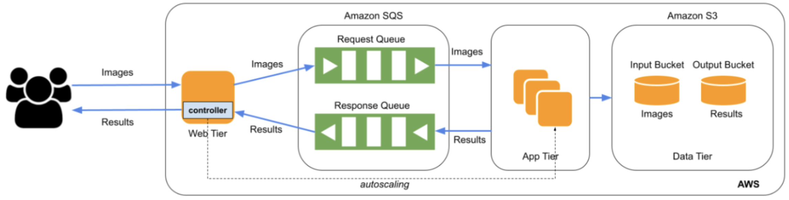

# Auto-Scaling Face Recognition on AWS

This project implements a cloud-native, elastic face recognition system using AWS IaaS resources. The architecture includes a Web Tier that accepts user image uploads and an App Tier that dynamically scales to handle inference using a pre-trained deep learning model. Redis is used to track real-time request metrics, AWS SQS for asynchronous communication, and S3 for persistent storage.

---

## 🚀 Features

* Multi-tier cloud architecture for real-time face recognition.
* Web Tier on EC2 handles file uploads, sends requests, and triggers autoscaling.
* App Tier with auto-scaling EC2 instances that run ML inference.
* Redis used to monitor request pressure for smarter autoscaling.
* SQS for decoupled request/response message handling.
* S3 used for persistent storage of input images and recognition results.
* Fully integrated with the workload generator and grading tools provided in the course.

---

## 📐 Architecture Overview

<p align="center">
  
</p>

---

## 🧠 Components

### Web Tier (`web-instance`)

* Receives `.jpg` images via HTTP POST requests.
* Pushes request metadata to SQS and stores files in S3 Input Bucket.
* Monitors Redis for request queue size to trigger scaling logic.
* Runs a custom Auto Scaling Controller to scale the App Tier up/down using `boto3`.

### App Tier (`app-tier-instance-<#>`)

* Launched from a custom AMI containing the PyTorch model.
* Polls SQS for new requests, runs face recognition, and posts results back to SQS and S3.
* Shuts down when idle, as determined by the Auto Scaling Controller.

### Data Tier

* **S3 Input Bucket**: Stores uploaded images.
* **S3 Output Bucket**: Stores plain text classification results (e.g., `test_00:Paul`).

---

## ⚙️ Setup Instructions

1. **Prepare App Tier AMI**

   * Base EC2: Amazon Linux or Ubuntu.
   * Install PyTorch (CPU only):

     ```bash
     pip3 install torch torchvision torchaudio --index-url https://download.pytorch.org/whl/cpu
     ```
   * Copy model and weights from the [provided repo](https://github.com/visa-lab/CSE546-Cloud-Computing/tree/main/model).
   * Create AMI for future scaling (`app-tier-instance-#`).

2. **Configure AWS Services**

   * **SQS**:

     * Request Queue: `<ASU ID>-req-queue`
     * Response Queue: `<ASU ID>-resp-queue`
   * **S3**:

     * Input Bucket: `<ASU ID>-in-bucket`
     * Output Bucket: `<ASU ID>-out-bucket`
   * **Redis**:

     * Deployed locally or using ElastiCache to track queue depth.

3. **Run Web Tier**

   * Flask API endpoint accepts file uploads at root (`/`).
   * Each request must include `inputFile` as the form key.
   * Response format: `filename:prediction` (plain text).
   * Redis monitors request queue length for real-time scaling decisions.

---

## ✅ Testing & Evaluation

Use the workload generator and testing script to test:

```bash
python3 workload_generator.py --n 10 --server http://<elastic-ip>/
```

Evaluation includes:

* EC2 autoscaling from 0 → peak → 0
* S3 object persistence
* Classification accuracy
* Queue health
* End-to-end latency < 2 mins for 10 requests

---

## 📊 Autoscaling Logic

* **Scale-Out**: Triggered if Redis metric (unprocessed queue length) exceeds threshold.
* **Scale-In**: Triggered when SQS is empty and instances have been idle for a fixed period.
* All autoscaling operations are performed via `boto3`, not AWS autoscaling groups.

---

## 👨‍💻 Author

**Karan Shiva**
GitHub: [@karan-shiva](https://github.com/karan-shiva)

---

Would you like me to add example `curl` commands or workload generator outputs in a demo section?
